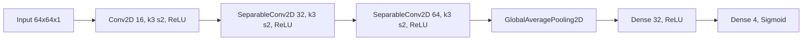

# Architecture Overview

このリポジトリは、TensorFlowでの学習実験を最小構成で開始し、後から機能を差し替え・拡張しやすくするためのテンプレートです。実装は責務分離できていますが、train.py から dataset.py / model.py を呼ぶ引数契約は現在ずれており、統合作業途中の状態です。

## モジュール一覧と役割

- src/train.py: 設定取得、前処理構築、データセット構築、モデル構築、Trainer実行を順番に記述するエントリーポイント。
- src/config.py: DataConfig / ModelConfig / TrainConfig / ExperimentConfig を dataclass で管理し、get_config() で返却。
- src/data/preprocess.py: cast_types と normalize_features を compose_preprocess で合成し、build_default_preprocess() を提供。
- src/data/dataset.py: 既に分割済みの train/val Tensor を受け取り、shuffle/map/batch/prefetch を適用して DatasetBundle を返却。
- src/models/model.py: 固定構成の CNN (Input 64x64x1 -> Conv2D -> SeparableConv2D x2 -> GAP -> Dense -> Dense) を返却。
- src/utils/metrics.py: SparseCategoricalCrossentropy と SparseCategoricalAccuracy を提供。
- src/utils/trainer.py: model.compile() と model.fit() をラップし、TrainResult(history) を返却。

## 設計原則

- 疎結合: モジュール間の依存を最小化し、差し替え範囲を局所化する。
- 単一責務: 各ファイルは明確な責務だけを持つ。
- 拡張前提: TODOコメントを残し、実運用機能を段階的に追加できる。
- 可読性: train.py だけ読めば学習全体の流れが把握できる。
- 現状課題: train.py の build_train_val_datasets(...) / build_model(...) 呼び出しは、各実装の現行シグネチャと一致していない。

## クラス図（概要）

モデル構成グラフ（models/model.py 実装準拠）:

