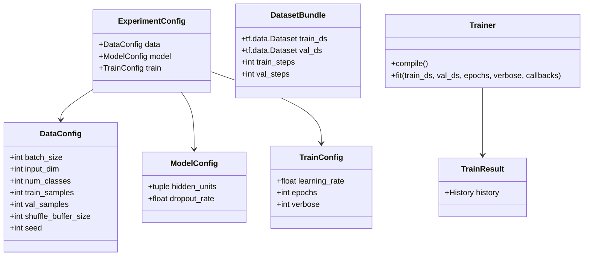

# Architecture Overview

このリポジトリは、TensorFlowでの学習実験を最小構成で開始し、後から機能を差し替え・拡張しやすくするためのテンプレートです。

## モジュール一覧と役割

- src/train.py: 学習の実行フローを順番に記述するエントリーポイント。
- src/config.py: データ・モデル・学習設定を dataclass で管理。
- src/data/preprocess.py: 前処理関数群と関数合成ロジック。
- src/data/dataset.py: 合成データ生成、tf.dataパイプライン構築、train/valのバンドル化。
- src/models/model.py: build_model() でKerasモデルを返す差し替えポイント。
- src/utils/metrics.py: 損失関数と評価指標の生成。
- src/utils/trainer.py: コンパイルと学習実行のオーケストレーション。

## 設計原則

- 疎結合: モジュール間の依存を最小化し、差し替え範囲を局所化する。
- 単一責務: 各ファイルは明確な責務だけを持つ。
- 拡張前提: TODOコメントを残し、実運用機能を段階的に追加できる。
- 可読性: train.py だけ読めば学習全体の流れが把握できる。

## クラス図（概要）

