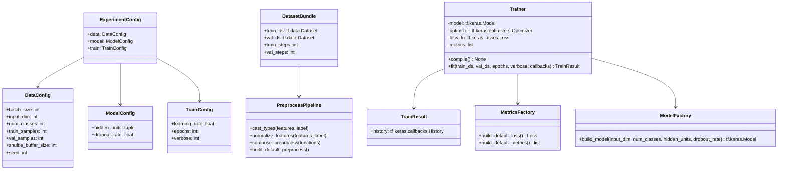

# クラス図（詳細）

TensorFlow学習テンプレートの主要構成要素を示します。

```mermaid
classDiagram
    class DataConfig {
        +batch_size: int
        +input_dim: int
        +num_classes: int
        +train_samples: int
        +val_samples: int
        +shuffle_buffer_size: int
        +seed: int
    }

    class ModelConfig {
        +hidden_units: tuple
        +dropout_rate: float
    }

    class TrainConfig {
        +learning_rate: float
        +epochs: int
        +verbose: int
    }

    class ExperimentConfig {
        +data: DataConfig
        +model: ModelConfig
        +train: TrainConfig
    }

    class DatasetBundle {
        +train_ds: tf.data.Dataset
        +val_ds: tf.data.Dataset
        +train_steps: int
        +val_steps: int
    }

    class Trainer {
        -model: tf.keras.Model
        -optimizer: tf.keras.optimizers.Optimizer
        -loss_fn: tf.keras.losses.Loss
        -metrics: list
        +compile() None
        +fit(train_ds, val_ds, epochs, verbose, callbacks) TrainResult
    }

    class TrainResult {
        +history: tf.keras.callbacks.History
    }

    class ModelFactory {
        +build_model(input_dim, num_classes, hidden_units, dropout_rate) tf.keras.Model
    }

    class MetricsFactory {
        +build_default_loss() Loss
        +build_default_metrics() list
    }

    class PreprocessPipeline {
        +cast_types(features, label)
        +normalize_features(features, label)
        +compose_preprocess(functions)
        +build_default_preprocess()
    }

    ExperimentConfig --> DataConfig
    ExperimentConfig --> ModelConfig
    ExperimentConfig --> TrainConfig
    Trainer --> TrainResult
    Trainer --> MetricsFactory
    Trainer --> ModelFactory
    DatasetBundle --> PreprocessPipeline
```

図は docs/architecture.md と整合しています。