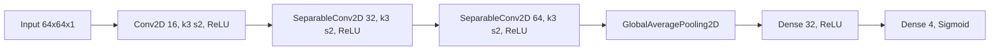

# Data Flow

データの流れ（設定 -> 前処理 -> データセット -> 学習 -> 出力）を、現行実装の契約に合わせて示します。

- 入力: src/config.py の ExperimentConfig
- 前処理: src/data/preprocess.py の関数合成
- 実行主体: src/train.py
- データ供給: src/data/dataset.py（分割済みTensorから tf.data を構築）
- 学習: src/utils/trainer.py
- 出力: 学習履歴と最終メトリクス表示

```mermaid
graph TD
    A[train.py main] --> B[get_config]
    A --> C[build_default_preprocess]

    B --> D[build_train_val_datasets(cfg.data, preprocess_fn)]
    D --> DERR{{dataset.py の契約不一致\n期待: train_x, train_y, val_x, val_y, batch_size, shuffle_buffer_size}}

    B --> E[build_model(input_dim, num_classes, hidden_units, dropout_rate)]
    E --> EERR{{model.py の契約不一致\n実装: build_model()}}

    F[dataset.py: build_train_val_datasets(...)] --> G[DatasetBundle(train_ds, val_ds, train_epoch_steps, val_epoch_steps)]
    H[model.py: build_model()] --> I[tf.keras.Model]
    J[build_default_optimizer] --> K[Trainer]
    L[build_default_loss] --> K
    M[build_default_metrics] --> K
    G --> K
    I --> K

    K --> N[model.compile]
    N --> O[model.fit]
    O --> P[TrainResult.history]
    P --> Q[final metrics print]
```

実運用では、まず train.py と dataset.py / model.py のインターフェースを揃えてから、前処理差し替え・モデル差し替え・データ読み込み差し替えを進める構成です。

モデル構成グラフ（models/model.py 実装準拠）:

