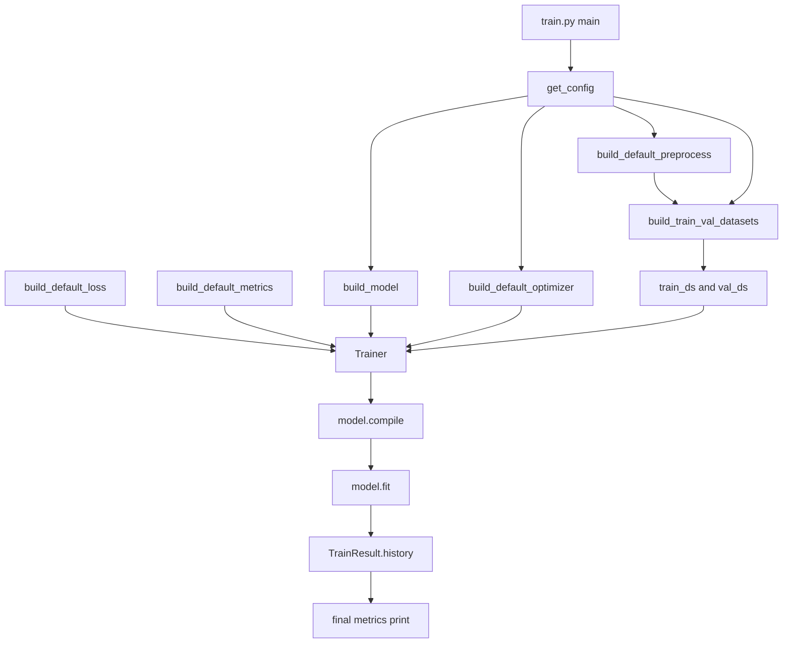

# Data Flow

データの流れ（設定 -> 前処理 -> データセット -> 学習 -> 出力）を示します。

- 入力: src/config.py の ExperimentConfig
- 前処理: src/data/preprocess.py の関数合成
- 実行主体: src/train.py
- データ供給: src/data/dataset.py（tf.data）
- 学習: src/utils/trainer.py
- 出力: 学習履歴と最終メトリクス表示

実運用では、前処理差し替え・モデル差し替え・データ読み込み差し替えをこの主経路に沿って行います。