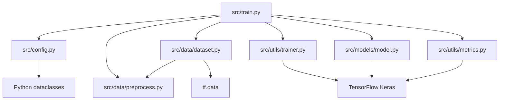

# モジュール依存関係

プロジェクト内部のモジュール依存を示します。

```mermaid
graph TD
    train_py["src/train.py"] --> config_py["src/config.py"]
    train_py --> dataset_py["src/data/dataset.py"]
    train_py --> preprocess_py["src/data/preprocess.py"]
    train_py --> model_py["src/models/model.py"]
    train_py --> metrics_py["src/utils/metrics.py"]
    train_py --> trainer_py["src/utils/trainer.py"]

    dataset_py --> preprocess_py
    trainer_py --> tf_keras["TensorFlow Keras"]
    model_py --> tf_keras
    metrics_py --> tf_keras
    dataset_py --> tf_data["tf.data"]

    config_py --> py_stdlib["Python dataclasses"]
```

- 循環依存はない。主経路は train.py から各モジュールへ一方向に依存する。
- data層は preprocessの関数型契約にのみ依存し、model/trainerへ依存しない。
- モデル・評価指標・学習実行は分離され、差し替え範囲が明確。