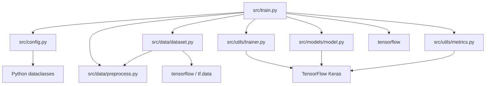
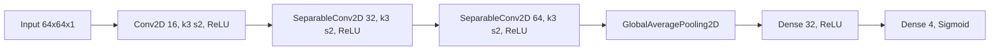

# モジュール依存関係

プロジェクト内部のモジュール依存を、現在の import 関係に合わせて示します。

- 循環依存はない。主経路は train.py から各モジュールへ一方向に依存する。
- data層は preprocess の型契約（PreprocessFn）に依存し、model/trainer へ依存しない。
- model / metrics / trainer は TensorFlow Keras に収束する。
- 依存関係は整理されているが、train.py と dataset.py / model.py 間の呼び出し契約には差分がある。

モデル構成グラフ（models/model.py 実装準拠）:

