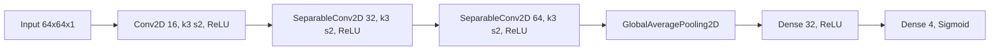

# 問題点と改善提案

## 実施済みの改善
- モジュール分離: config / data / models / utils / train の責務を分離。
- 前処理差し替え: preprocess 関数を合成して差し替え可能な構成に整理。
- データ入力標準化: tf.data で前処理を組み込む build_dataset を実装。
- 学習処理のラップ: Trainer 経由で compile / fit を実行する構成を整備。
- モデル定義の独立化: models/model.py で CNN 構成を単独管理。

## 残課題（次の改善候補）

1) train.py と dataset.py の引数契約統一
  - train.py は cfg.data を渡しているが、dataset.py は train_x/train_y/val_x/val_y/batch_size/shuffle_buffer_size を要求するため、どちらかへ統一する。

2) train.py と model.py の引数契約統一
  - train.py は build_model(...) に複数引数を渡しているが、model.py は build_model() のみ実装している。

3) 出力層と損失・評価指標の整合
  - 現在は Dense(4, sigmoid) と SparseCategoricalCrossentropy / SparseCategoricalAccuracy の組み合わせで、単一ラベル分類としては不整合の可能性がある。

4) 設定項目の実使用との一致
  - DataConfig.input_dim / num_classes、ModelConfig.hidden_units / dropout_rate が現行 model.py に反映されないため、利用経路を定義する。

5) 設定管理の外部化
  - dataclass 固定値に加え、YAML/JSON/CLI 上書きに対応する。

6) 学習ループの機能拡張
  - ModelCheckpoint、EarlyStopping、学習率スケジューラを標準実装する。

7) データ入力の実運用化
  - 実データローダーまたは合成データ生成処理を train.py から呼べるようにし、dataset.py の契約を満たす。

8) 評価と実験管理
  - F1/AUC などタスク指標追加、学習履歴保存、実験トラッキングを導入する。

## 実装チェックリスト（現時点）
- [x] train.py で全体フローが追える構成
- [x] モジュール責務分離
- [x] 前処理差し替え可能な構成
- [x] tf.data ベースのデータパイプライン
- [x] モデル定義の独立化
- [ ] train.py と dataset.py の引数契約一致
- [ ] train.py と model.py の引数契約一致
- [ ] 出力層と損失・評価指標の整合
- [ ] 合成または実データ入力を含む end-to-end 実行
- [ ] 外部設定ファイル対応
- [ ] 学習コールバック標準化
- [ ] 実験管理（ログ・成果物保存）

モデル構成グラフ（models/model.py 実装準拠）:

